x<p align="center">
  
  
  
  
</p>

# 🛩️ PCAP Analyzer — Détection de Drones par Analyse Wi-Fi

> **TP1 : Analyse de trames réseaux** — Identification des trames Wi-Fi de signalement électronique de drones (DroneID) et extraction des informations de localisation.
>
> Auteur du TP : **Christophe BARÈS**

---

## 📋 Table des matières

- [🛩️ PCAP Analyzer — Détection de Drones par Analyse Wi-Fi](#️-pcap-analyzer--détection-de-drones-par-analyse-wi-fi)
  - [📋 Table des matières](#-table-des-matières)
  - [🎯 Présentation](#-présentation)
  - [✨ Fonctionnalités](#-fonctionnalités)
  - [🏗️ Architecture du projet](#️-architecture-du-projet)
    - [Diagramme d'architecture](#diagramme-darchitecture)
    - [Flux de traitement des paquets](#flux-de-traitement-des-paquets)
  - [📦 Prérequis](#-prérequis)
    - [Installation des dépendances système](#installation-des-dépendances-système)
  - [🔧 Installation](#-installation)
  - [🚀 Utilisation](#-utilisation)
    - [Aide en ligne de commande](#aide-en-ligne-de-commande)
    - [Analyse d'un fichier PCAP](#analyse-dun-fichier-pcap)
    - [Lister les interfaces réseau](#lister-les-interfaces-réseau)
    - [Capture en temps réel](#capture-en-temps-réel)
    - [Export des résultats](#export-des-résultats)
  - [🔬 Analyse avec Wireshark](#-analyse-avec-wireshark)
    - [Vue d'ensemble des trames](#vue-densemble-des-trames)
    - [Identification d'une trame beacon standard](#identification-dune-trame-beacon-standard)
    - [Identification d'une trame DroneID](#identification-dune-trame-droneid)
    - [Comparaison : Beacon standard vs DroneID](#comparaison--beacon-standard-vs-droneid)
  - [🛩️ Détection DroneID](#️-détection-droneid)
    - [Structure des trames](#structure-des-trames)
    - [Format TLV DroneID](#format-tlv-droneid)
    - [Résultats de détection](#résultats-de-détection)
  - [📄 Exemples de sortie](#-exemples-de-sortie)
    - [JSON](#json)
    - [CSV](#csv)
  - [📚 Documentation](#-documentation)
    - [Vérification qualité](#vérification-qualité)
  - [📖 Dépendances](#-dépendances)
  - [⚖️ Référence légale](#️-référence-légale)

---

## 🎯 Présentation

Ce projet est un analyseur de trames Wi-Fi écrit en **Rust** capable de :

1. **Lire un fichier PCAP** capturé en mode monitor et identifier les trames beacon 802.11
2. **Détecter les trames DroneID** (signalement électronique français) parmi les trames beacon
3. **Extraire les données de vol** : identifiant du drone, position GPS, altitude, vitesse, cap
4. **Exporter les résultats** en JSON ou CSV
5. **Capturer en temps réel** via une interface Wi-Fi en mode monitor

Le programme implémente le décodage complet de la pile protocolaire : **Radiotap → 802.11 MAC → Management Frame → TLV → Vendor Specific (DroneID)**, conformément à l'[arrêté du 27 décembre 2019](https://www.legifrance.gouv.fr/jorf/id/JORFTEXT000039685188).

---

## ✨ Fonctionnalités

| Fonctionnalité | Description | Status |
|---|---|---|
| Parsing PCAP | Lecture et décodage de fichiers `.pcap` / `.pcapng` | ✅ |
| Détection beacon | Identification des trames beacon (type 0, subtype 8) | ✅ |
| Extraction SSID | Récupération du nom réseau via TLV type `0x00` | ✅ |
| Détection DroneID | Identification des Vendor Specific `0xDD` DroneID (OUI `6A:5C:35`) | ✅ |
| Parsing DroneID | Extraction complète des champs : ID, GPS, altitude, vitesse, cap | ✅ |
| Export JSON | Sérialisation avec `serde_json` | ✅ |
| Export CSV | Export tabulaire avec la crate `csv` | ✅ |
| Capture live | Capture en temps réel sur interface Wi-Fi monitor | ✅ |
| Liste interfaces | Énumération des cartes réseau disponibles | ✅ |
| CLI complète | Arguments avec `clap` (mode derive), conflits gérés | ✅ |
| Architecture lib | Code organisé en modules réutilisables (`lib.rs`) | ✅ |
| Documentation | Commentaires `///` et génération avec `cargo doc` | ✅ |

---

## 🏗️ Architecture du projet

```
pcap_analyzer/
├── Cargo.toml          # Dépendances et métadonnées du projet
├── Cargo.lock          # Versions exactes des dépendances
├── build.rs            # Script de build (link natif libpcap)
├── src/
│   ├── main.rs         # Point d'entrée — orchestration CLI
│   ├── lib.rs          # Déclaration des modules (bibliothèque)
│   ├── cli.rs          # Définition des arguments (clap derive)
│   ├── parser.rs       # Parsing Radiotap + 802.11 + TLV
│   ├── drone_id.rs     # Décodage spécifique DroneID
│   └── output.rs       # Sérialisation JSON / CSV
├── lib/
│   └── libwpcap.a      # Bibliothèque native pcap
├── results.json        # Exemple de sortie JSON
└── drone_results.json  # Résultats filtrés drones
```

### Diagramme d'architecture

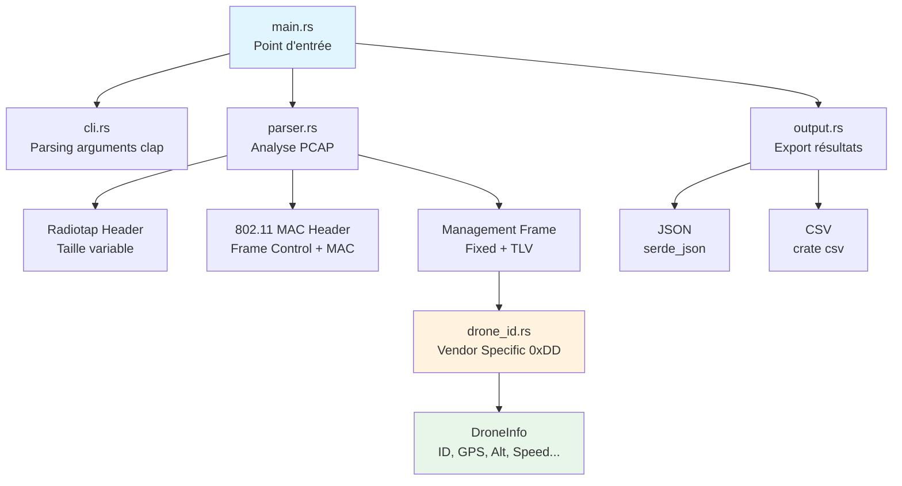

### Flux de traitement des paquets

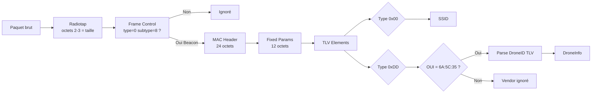

---

## 📦 Prérequis

- **Rust** ≥ 1.85 (edition 2024)
- **libpcap-dev** (Linux) ou **Npcap** (Windows)
- **Wireshark** (pour l'analyse manuelle des captures)
- Droits administrateur/root pour la capture en temps réel

### Installation des dépendances système

```bash
# Ubuntu / Debian
sudo apt install libpcap-dev wireshark

# Arch Linux
sudo pacman -S libpcap wireshark-qt

# macOS
brew install libpcap wireshark
```

---

## 🔧 Installation

```bash
# Cloner le projet
git clone https://github.com/Nameless0l/pcap_analyzer
cd pcap_analyzer

# Compiler le projet
cargo build --release

# Vérifier l'absence de warnings
cargo clippy

# Générer la documentation
cargo doc --open
```

---

## 🚀 Utilisation

### Aide en ligne de commande

```bash
cargo run -- --help
```

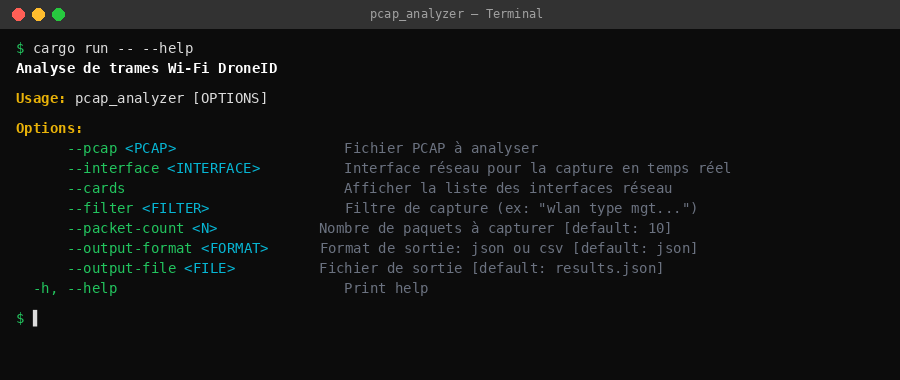

---

### Analyse d'un fichier PCAP

```bash
cargo run -- --pcap capture.pcap
```

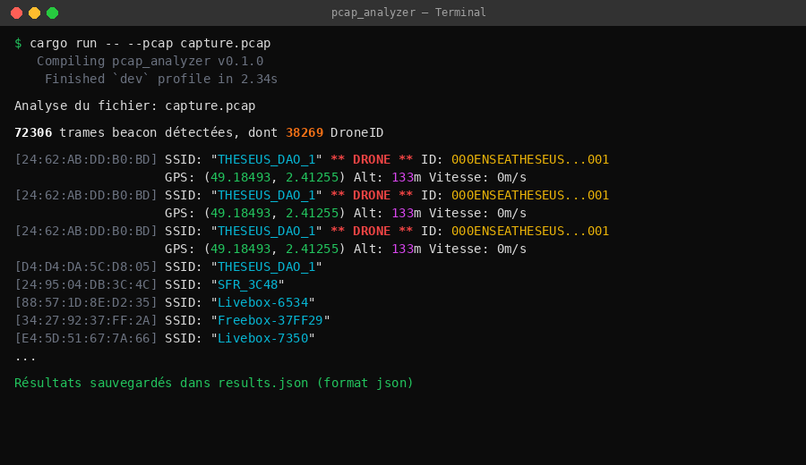

---

### Lister les interfaces réseau

```bash
cargo run -- --cards
```

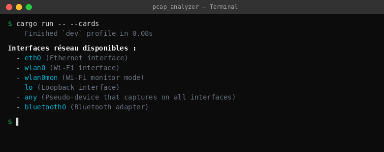

---

### Capture en temps réel

```bash
# Capture de 20 trames beacon sur wlan0mon
sudo cargo run -- --interface wlan0mon --filter "wlan type mgt subtype beacon" --packet-count 20
```
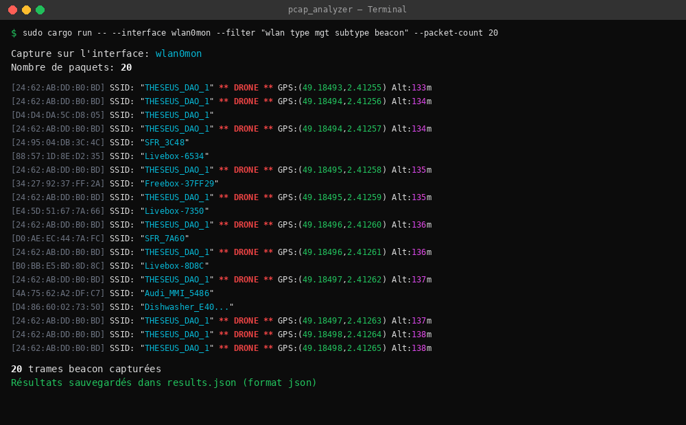

---

### Export des résultats

```bash
# Export JSON (défaut)
cargo run -- --pcap capture.pcap --output-format json --output-file results.json

# Export CSV
cargo run -- --pcap capture.pcap --output-format csv --output-file results.csv
```

**Export JSON :**

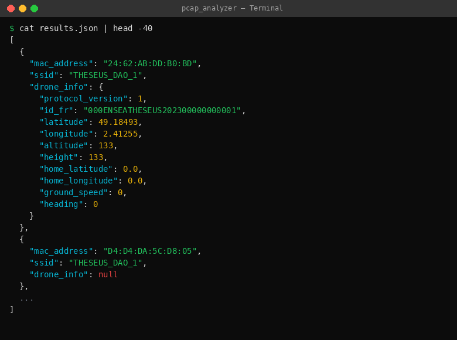

**Export CSV :**

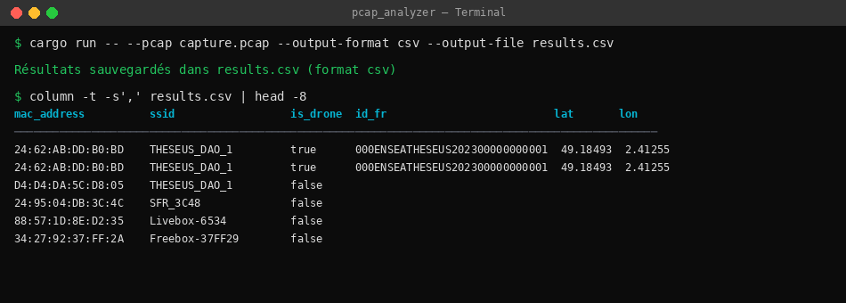

---

## 🔬 Analyse avec Wireshark

Avant de coder l'analyseur, une étude manuelle du fichier PCAP avec Wireshark permet de comprendre la structure des trames.

### Vue d'ensemble des trames

Le fichier de capture contient des trames Wi-Fi capturées en **mode monitor**, incluant :
- Des trames **beacon** (annonce de réseaux Wi-Fi)
- Des trames de **probe request/response**
- Des trames de **data** et **acknowledgement**
- Des trames **DroneID** déguisées en beacon frames

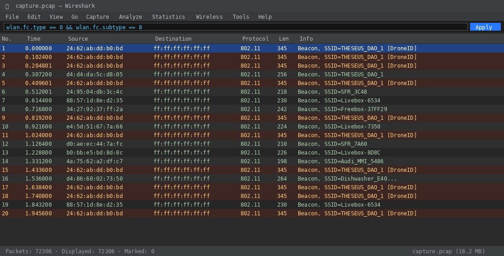

### Identification d'une trame beacon standard

Les trames beacon contiennent l'en-tête Radiotap, suivi du Frame Control (`0x0080` pour un beacon), puis les éléments tagged (SSID, Supported Rates, DS Parameter, etc.).

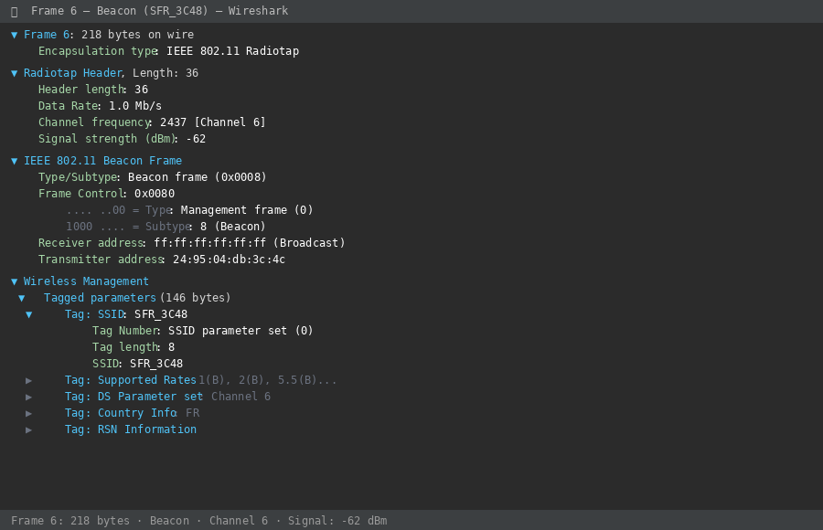

### Identification d'une trame DroneID

Les trames DroneID se distinguent par la présence d'un élément **Vendor Specific (tag 0xDD)** dont l'OUI est `6A:5C:35` et le VS Type est `0x01`. Le payload contient les données de signalement au format TLV.

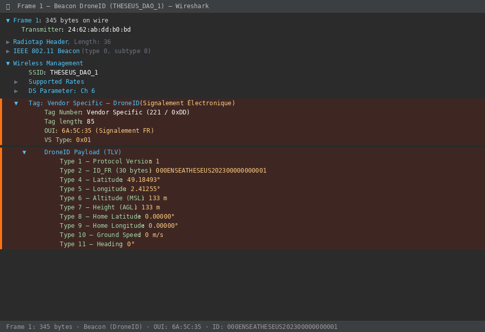

### Comparaison : Beacon standard vs DroneID

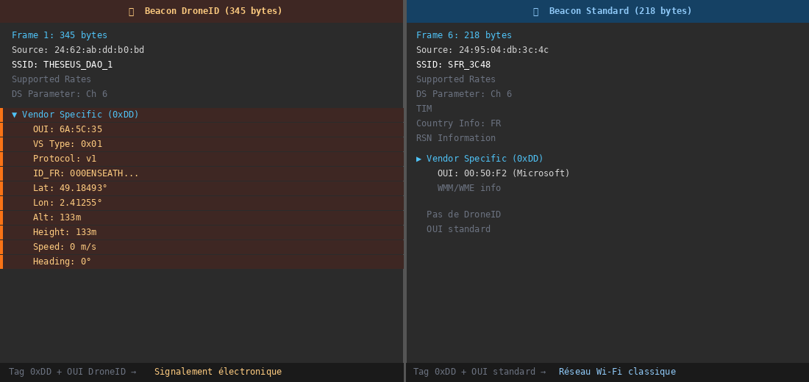

---

## 🛩️ Détection DroneID

### Structure des trames

Le programme décode la pile protocolaire complète d'un paquet Wi-Fi capturé en mode monitor :

```
┌─────────────────────────────────────────────────────────┐
│ Radiotap Header (taille variable, octets 2-3 = len)     │
├─────────────────────────────────────────────────────────┤
│ 802.11 MAC Header (24 octets pour beacon)               │
│   ├─ Frame Control: type=0 (mgmt), subtype=8 (beacon)   │
│   ├─ Duration                                           │
│   ├─ Address 1 (Destination)                            │
│   ├─ Address 2 (Source / Transmitter) ← MAC du drone    │
│   ├─ Address 3 (BSSID)                                  │
│   └─ Sequence Control                                   │
├─────────────────────────────────────────────────────────┤
│ Management Fixed Parameters (12 octets)                 │
│   ├─ Timestamp (8 octets)                               │
│   ├─ Beacon Interval (2 octets)                         │
│   └─ Capability Info (2 octets)                         │
├─────────────────────────────────────────────────────────┤
│ Tagged Parameters (TLV, taille variable)                │
│   ├─ Tag 0x00: SSID                                     │
│   ├─ Tag 0x01: Supported Rates                          │
│   ├─ Tag 0x03: DS Parameter (canal)                     │
│   ├─ ...                                                │
│   └─ Tag 0xDD: Vendor Specific ← DroneID ici            │
│       ├─ OUI: 6A:5C:35                                  │
│       ├─ VS Type: 0x01                                  │
│       └─ Payload TLV DroneID                            │
└─────────────────────────────────────────────────────────┘
```

### Format TLV DroneID

Une fois le Vendor Specific identifié (OUI `6A:5C:35`, VS Type `0x01`), le payload est décodé selon le format TLV du signalement électronique :

| Type | Champ | Format | Description |
|------|-------|--------|-------------|
| 1 | Protocol Version | `u8` | Version du protocole de signalement |
| 2 | ID_FR | `UTF-8` (30 octets) | Identifiant français du drone |
| 3 | ID_ANSI_CTA | — | Identifiant ANSI/CTA (optionnel) |
| 4 | Latitude | `i32` BE × 10⁻⁵ | Latitude courante (WGS84) |
| 5 | Longitude | `i32` BE × 10⁻⁵ | Longitude courante (WGS84) |
| 6 | Altitude | `i16` BE | Altitude MSL (mètres) |
| 7 | Height | `i16` BE | Hauteur au-dessus du décollage (mètres) |
| 8 | Home Latitude | `i32` BE × 10⁻⁵ | Latitude du point de décollage |
| 9 | Home Longitude | `i32` BE × 10⁻⁵ | Longitude du point de décollage |
| 10 | Ground Speed | `u8` | Vitesse au sol (m/s) |
| 11 | Heading | `u16` BE | Cap (0-359°) |

### Résultats de détection

Sur le fichier de capture fourni, le programme a détecté :

| Métrique | Valeur |
|----------|--------|
| **Total trames beacon** | 72 306 |
| **Trames DroneID** | 38 269 |
| **Identifiants uniques** | 1 (`000ENSEATHESEUS202300000000001`) |
| **SSIDs détectés** | 9 (THESEUS_DAO_1, Freebox-37FF29, Livebox-7350, SFR_3C48, ...) |
| **Adresses MAC uniques** | 10 |

Le drone détecté (THESEUS_DAO_1) émet depuis la position GPS **49.18493°N, 2.41255°E** à une altitude de **133m**.

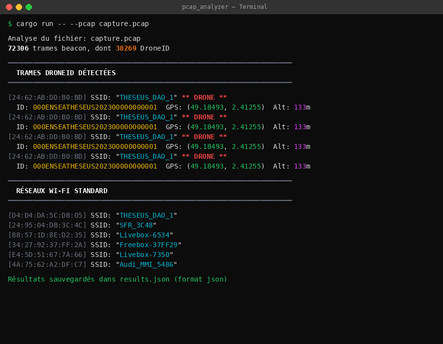

---

## 📄 Exemples de sortie

### JSON

```json
{
  "mac_address": "24:62:AB:DD:B0:BD",
  "ssid": "THESEUS_DAO_1",
  "drone_info": {
    "protocol_version": 1,
    "id_fr": "000ENSEATHESEUS202300000000001",
    "latitude": 49.18493,
    "longitude": 2.41255,
    "altitude": 133,
    "height": 133,
    "home_latitude": 0.0,
    "home_longitude": 0.0,
    "ground_speed": 0,
    "heading": 0
  }
}
```

### CSV

```csv
mac_address,ssid,is_drone,id_fr,latitude,longitude,altitude,height,home_latitude,home_longitude,ground_speed,heading
24:62:AB:DD:B0:BD,THESEUS_DAO_1,true,000ENSEATHESEUS202300000000001,49.18493,2.41255,133,133,0.0,0.0,0,0
D4:D4:DA:5C:D8:05,THESEUS_DAO_1,false,,,,,,,,
```

---

## 📚 Documentation

Le code est entièrement documenté avec des commentaires `///`. Pour générer et consulter la documentation :

```bash
cargo doc --open
```

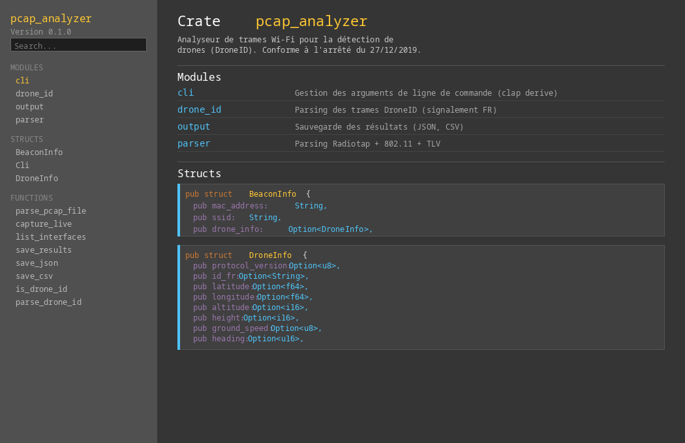

### Vérification qualité

```bash
# Aucun warning avec clippy
cargo clippy

# Tests de compilation
cargo build --release
```

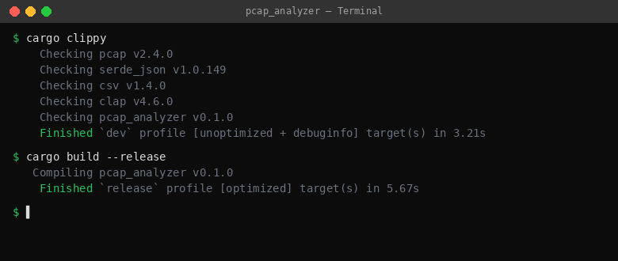

---

## 📖 Dépendances

| Crate | Version | Rôle |
|-------|---------|------|
| [`clap`](https://crates.io/crates/clap) | 4.6.0 | Gestion des arguments CLI (mode derive) |
| [`pcap`](https://crates.io/crates/pcap) | 2.4.0 | Lecture PCAP et capture réseau |
| [`serde`](https://crates.io/crates/serde) | 1.0.228 | Framework de sérialisation |
| [`serde_json`](https://crates.io/crates/serde_json) | 1.0.149 | Export JSON |
| [`csv`](https://crates.io/crates/csv) | 1.4.0 | Export CSV |

---

## ⚖️ Référence légale

Le signalement électronique des drones est réglementé par :

> **Arrêté du 27 décembre 2019** relatif à l'enregistrement, au signalement électronique et au signalement lumineux des aéronefs circulant sans personne à bord.
>
> 🔗 [JORF n°0303 du 31 décembre 2019](https://www.legifrance.gouv.fr/jorf/id/JORFTEXT000039685188)

Cet arrêté définit le format des trames Wi-Fi que les drones doivent émettre pour signaler leur présence, incluant l'identifiant unique, la position GPS, l'altitude et la vitesse.

