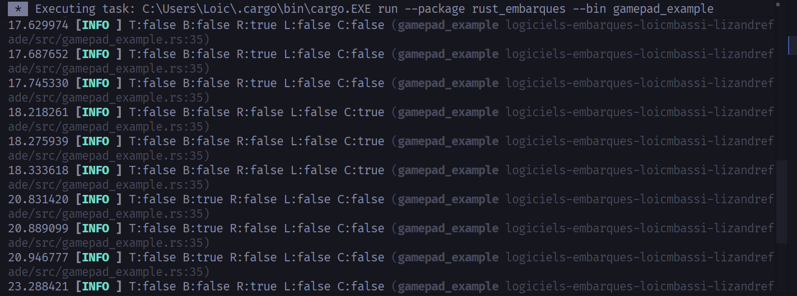
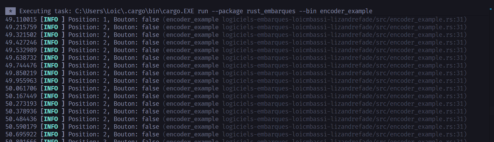
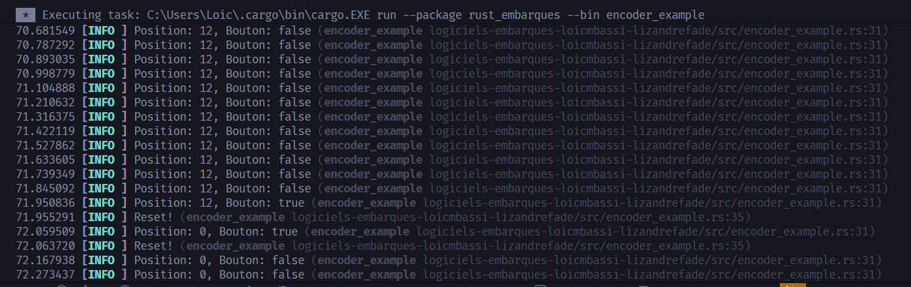
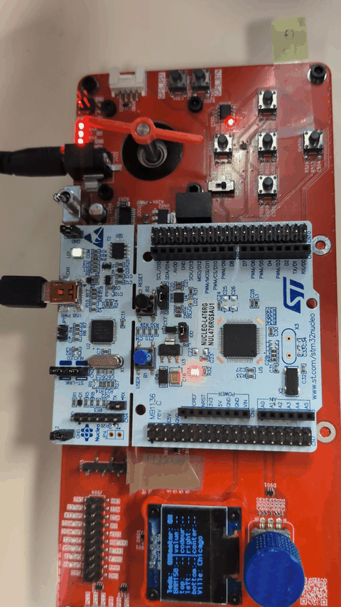
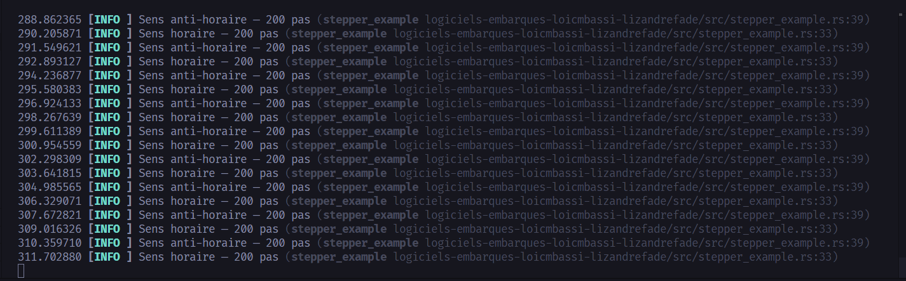
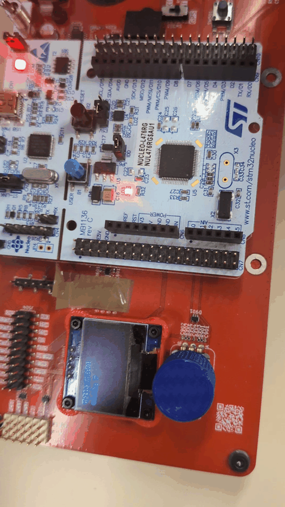

# TP3 — Rust Embarqué : Embassy & Périphériques

Firmware embarqué pour la carte ENSEA basée sur une **Nucleo-64 STM32L476RG**, développé en Rust avec [Embassy](https://embassy.dev/).

---

## Structure du projet

```
src/
├── bsp-ensea.rs          # Board Support Package — mapping pins/périphériques
├── bargraph.rs           # Driver bargraph 8 LEDs (générique)
├── bargraph_example.rs   # Démo bargraph : montée/descente en boucle
├── encoder.rs            # Driver encodeur rotatif (QEI + bouton)
├── encoder_example.rs    # Démo encodeur : position + reset au bouton
├── stepper.rs            # Driver moteur pas à pas (TMC2226)
├── stepper_example.rs    # Démo stepper : rotation aller-retour
├── stepper_encoder.rs    # Démo combinée : encodeur contrôle vitesse/direction moteur
├── display_example.rs    # Démo écran OLED SSD1306
├── gamepad.rs            # Driver gamepad (5 boutons)
├── gamepad_example.rs    # Démo gamepad : affichage état boutons via defmt
└── main.rs               # Point d'entrée minimal
```

---

## Partie 1 — Board Support Package (BSP)

Le BSP (`bsp-ensea.rs`) centralise toutes les associations pins ↔ périphériques de la carte ENSEA. Il expose une struct `Board` initialisée une seule fois depuis `embassy_stm32::init()`.

| Périphérique | Struct BSP | Pins |
|---|---|---|
| Bargraph (8 LEDs) | `BargraphPins` | PC7, PB2, PA8, PB1, PB15, PB4, PB14, PB5 |
| GPS | `GpsPins` | PB13 |
| GPIO | `GpioPins` | PA5 (LED), PC13 (bouton) |
| Gamepad | `GamepadPins` | PC8, PB11, PC9, PC6, PC5 |
| Magnétomètre | `MagnetoPins` | PC1, PB0 |
| Encodeur rotatif | `EncoderPins` | PA15 (btn), PA0/PA1 (QEI), TIM2 |
| Moteur pas à pas | `StepperPins` | PA7, PA11, PB12, PA12, PA6 |
| USART1 | `Usart1Pins` | PA9/PA10 |
| USART2 | `Usart2Pins` | PA2/PA3 |
| SPI2 | `Spi2Pins` | PB10, PC3, PC2, PC0 |
| I2C1 | `I2c1Pins` | PB6 (SCL) / PB7 (SDA) |
| Connecteur libre | `ConnectorPins` | PC10–PC12, PB8/PB9, PD2 |

Les pins GPIO sont stockées sous forme de `Peri<'static, AnyPin>` (type effacé). Les pins nécessitant un trait spécifique (ex: `TimerPin` pour le QEI, `SclPin`/`SdaPin` pour l'I2C) conservent leur type concret.

---

## Partie 2 — Drivers

### Bargraph

Driver générique `Bargraph<const N: usize>` — fonctionne avec n'importe quel nombre de LEDs.

```rust
let mut bargraph: Bargraph<8> = Bargraph::new([
    board.bargraph.led0, /* ... */ board.bargraph.led7,
]);
bargraph.set_range(0, 100);
bargraph.set_value(50); // allume 4 LEDs sur 8
```

**Démo :** `cargo run --bin bargraph_example`


---

### Gamepad

Driver `Gamepad` pour la croix de 5 boutons (haut, bas, gauche, droite, centre). Lecture synchrone par polling, actif bas avec Pull::Up.

```rust
let pad = Gamepad::new(
    board.gamepad.top, board.gamepad.bottom,
    board.gamepad.right, board.gamepad.left, board.gamepad.center,
);

let state = pad.poll();             // lecture de tous les boutons
pad.is_pressed(&Button::Center)     // lecture d'un bouton spécifique
```

**Démo :** `cargo run --bin gamepad_example`

---

### Encodeur rotatif

Driver `Encoder` basé sur `embassy_stm32::timer::qei::Qei` (interface QEI matérielle via TIM2).

- Compteur centré sur 5000 (plage 0–10 000), position relative retournée en `i32`
- Accès direct aux registres PAC pour `set_position` et `reset`
- Lecture du bouton intégré (actif bas, Pull::Up)


**Démo :** `cargo run --bin encoder_example`

| Rotation | Bouton pressé → reset |
|---|---|
|  |  |

---

### Moteur pas à pas (TMC2226)

Driver `Stepper` pour le TMC2226 — contrôle direction, microstepping et génération des impulsions STEP.

| Mode | MS1 | MS2 |
|---|---|---|
| Full | 0 | 0 |
| Half | 1 | 0 |
| Quarter | 0 | 1 |
| Eighth | 1 | 1 |

```rust
let mut motor = Stepper::new(
    board.stepper.dir, board.stepper.ms1, board.stepper.ms2,
    board.stepper.enable, board.stepper.step,
);
motor.set_microstep(MicrostepMode::Eighth);
motor.enable();
motor.set_direction(Direction::Clockwise);
motor.move_steps(200, 500).await; // 200 pas, demi-période 500 µs
```

**Démo :** `cargo run --bin stepper_example`

| Rotation aller-retour | Sortie terminal |
|---|---|
|  |  |

---

### Encodeur + Moteur pas à pas

Contrôle de la vitesse et direction du moteur via l'encodeur rotatif.

- Tourner dans le sens horaire → accélère (sens horaire)
- Tourner dans le sens anti-horaire → ralentit, puis repart en sens inverse
- Cliquer → arrêt immédiat, vitesse remise à zéro

```rust
// Voir src/stepper_encoder.rs
```

**Démo :** `cargo run --bin stepper_encoder`


---

### Écran OLED SSD1306 (I2C)

Affichage via `ssd1306` + `embedded-graphics` sur bus I2C1 (PB6/PB7).

```rust
let i2c = I2c::new_blocking(board.i2c1.i2c, board.i2c1.scl, board.i2c1.sda, Default::default());
let interface = I2CDisplayInterface::new(i2c);
let mut display = Ssd1306::new(interface, DisplaySize128x64, DisplayRotation::Rotate0)
    .into_buffered_graphics_mode();
display.init().unwrap();
```

**Démo :** `cargo run --bin display_example`



---

## Flasher un exemple

```bash
cargo run --bin bargraph_example
cargo run --bin gamepad_example
cargo run --bin encoder_example
cargo run --bin stepper_example
cargo run --bin stepper_encoder
cargo run --bin display_example
```

Prérequis : [`probe-rs`](https://probe.rs/) installé et carte connectée via ST-Link.

---

## Dépendances principales

| Crate | Version | Rôle |
|---|---|---|
| `embassy-stm32` | 0.5.0 | HAL STM32L476RG |
| `embassy-executor` | 0.9.1 | Runtime async embarqué |
| `embassy-time` | 0.5.0 | Timers async |
| `heapless` | 0.9.2 | Collections sans heap |
| `ssd1306` | 0.10 | Driver écran OLED SSD1306 |
| `embedded-graphics` | 0.8 | Dessin/texte pour écran |
| `defmt` + `defmt-rtt` | 1.x | Logs via RTT |


By Loic Aron Mbassi Ewolo & Lizandre Fade
