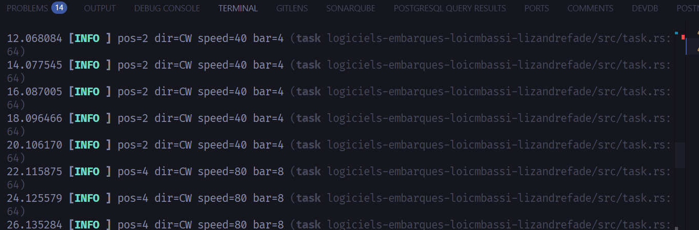

# TP4(Suite et fin du TP 3 partie3 + 4 + Bonus) : Rust Embarqué : Embassy & Périphériques

## Partie 3 : Tâches asynchrones avec état partagé

Le programme `task.rs` décompose le système en **6 tâches async concurrentes** communiquant via des variables atomiques et des signaux Embassy.

### Architecture

```
encoder_task (2000 ms)
    ├── position → BARGRAPH_LEVEL ──→ BARGRAPH_SIGNAL ──→ bargraph_task → LEDs
    └── position → STEPPER_SPEED/DIR → STEPPER_SIGNAL ──→ stepper_task  → moteur PWM

gamepad_task (50 ms)
    └── poll → GAMEPAD_STATE (AtomicU8)

emergency_stop_task (EXTI falling edge)
    └── bouton encodeur → arrêt moteur + RAZ encodeur

display_task (200 ms)
    └── lit tous les états partagés → affiche sur OLED
```

### Variables partagées

| Variable | Type | Définie dans | Producteur | Consommateur |
|---|---|---|---|---|
| `BARGRAPH_LEVEL` | `AtomicU32` | `bargraph.rs` | `encoder_task` | `bargraph_task` |
| `BARGRAPH_SIGNAL` | `Signal<CriticalSectionRawMutex, ()>` | `bargraph.rs` | `encoder_task` | `bargraph_task` |
| `STEPPER_SPEED` | `AtomicU32` | `stepper.rs` | `encoder_task` | `stepper_task` |
| `STEPPER_DIRECTION` | `AtomicU8` | `stepper.rs` | `encoder_task` | `stepper_task` |
| `STEPPER_SIGNAL` | `Signal<CriticalSectionRawMutex, ()>` | `stepper.rs` | `encoder_task` | `stepper_task` |
| `ENCODER_POSITION` | `AtomicI32` | `encoder.rs` | `encoder_task` | `display_task` |
| `GAMEPAD_STATE` | `AtomicU8` | `gamepad.rs` | `gamepad_task` | `display_task` |

### Méthodes statiques des drivers

Chaque driver expose des méthodes statiques appelables depuis n'importe quelle tâche :

```rust
// Depuis encoder_task :
Bargraph::<8>::update_value(level);      // met à jour + signale
Stepper::update_speed(speed, direction); // met à jour + signale

// Depuis display_task (lecture seule) :
Stepper::get_speed();                    // → u32
Stepper::get_direction();                // → Direction
Encoder::get_position();                 // → i32
Gamepad::get_shared_state();             // → GamepadState
```


### Démo combinée

**Démo :** `cargo run --bin task`


### Arrêt d'urgence

Le bouton central de l'encodeur est configuré en **interruption EXTI** (front descendant). Quand il est pressé :
1. Arrêt immédiat du moteur (`STEPPER_SPEED = 0`)
2. RAZ du bargraph
3. Désactivation du timer encodeur (TIM2) et compteur remis à zéro



---

## Bonus : Affichage OLED en temps réel

La `display_task` affiche sur l'écran OLED SSD1306 l'état complet du système, rafraîchi toutes les 200 ms :

```
Motor: 200 sps CW
Encoder: 10
Pad: . B . R .
```

- **Ligne 1** : vitesse moteur (pas/s) et direction (CW / CCW)
- **Ligne 2** : position de l'encodeur rotatif
- **Ligne 3** : état du gamepad (T/B/L/R/C ou `.` si relâché)


---

## Flasher un exemple

```bash
cargo run --bin bargraph_example
cargo run --bin gamepad_example
cargo run --bin encoder_example
cargo run --bin stepper_example
cargo run --bin stepper_encoder
cargo run --bin display_example
cargo run --bin task              # programme complet (6 tâches)
```

Prérequis : [`probe-rs`](https://probe.rs/) installé et carte connectée via ST-Link.

---

## Dépendances principales

| Crate | Version | Rôle |
|---|---|---|
| `embassy-stm32` | 0.5.0 | HAL STM32L476RG |
| `embassy-executor` | 0.9.1 | Runtime async embarqué |
| `embassy-time` | 0.5.0 | Timers async |
| `embassy-sync` | 0.7.2 | Signal, Mutex (synchronisation inter-tâches) |
| `heapless` | 0.9.2 | Collections sans heap |
| `ssd1306` | 0.10 | Driver écran OLED SSD1306 |
| `embedded-graphics` | 0.8 | Dessin/texte pour écran |
| `defmt` + `defmt-rtt` | 1.x | Logs via RTT |


By [Loic Aron Mbassi Ewolo](https://github.com/Nameless0l) & Lizandre Fade
